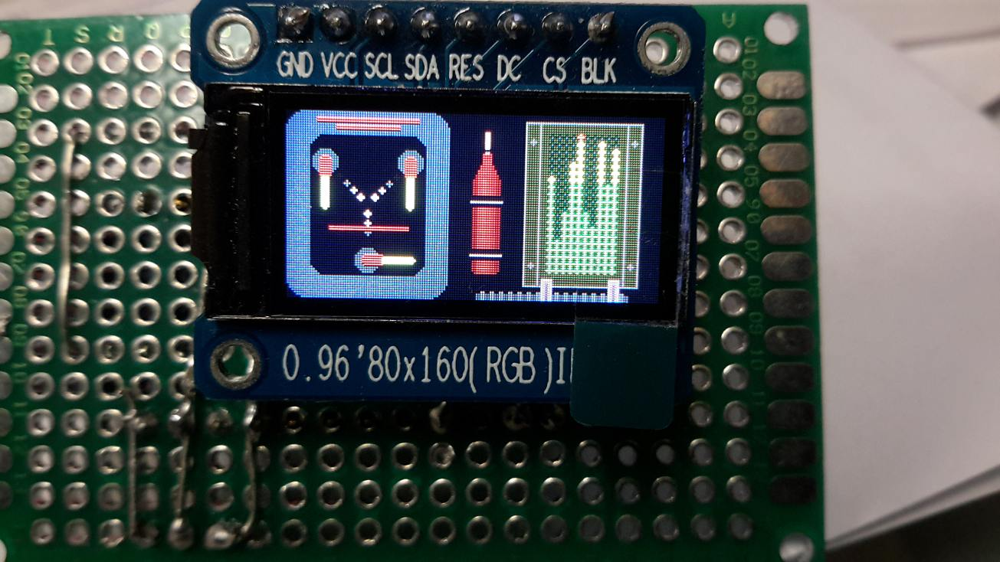

#    Arduino code for the Back-to-the-Future brick stage with Doc and Marty

The code is running on a Arduino Pro Mini 328 16MHz 5V (168 does not work),
and uses a 0.96" LED display for showing a Flux Capacitor, Time Circuits, 
Analog Gauges, and the SID panel from the Time Machine

