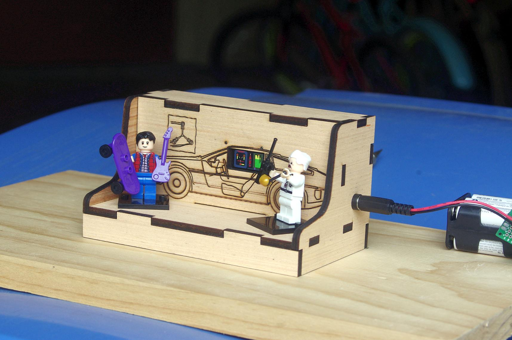

#  Brick Stage

A little stage for brick figures of Marty and Doc Brown made from 3/16" plywood with a laser cutter. The 0.96" LCD display is operated by and Arduino pro Mini.

The build is documented here:

https://markus-wobisch.blogspot.com/2019/05/brick-stage-marty-doc-back-to-future.html

